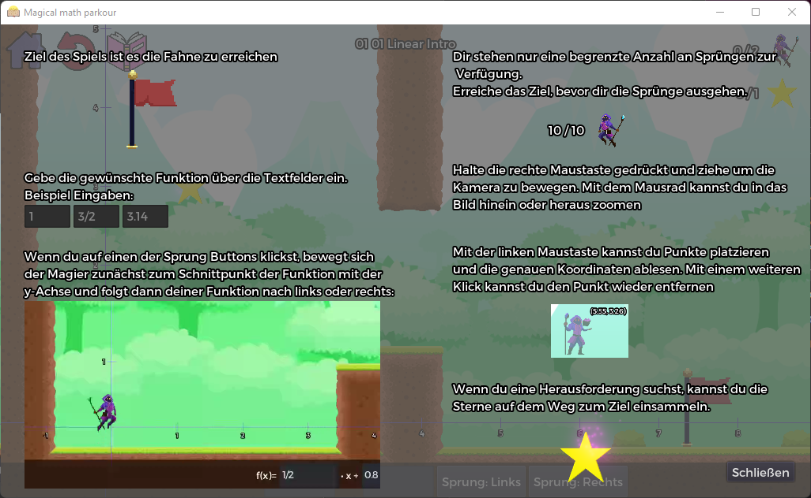
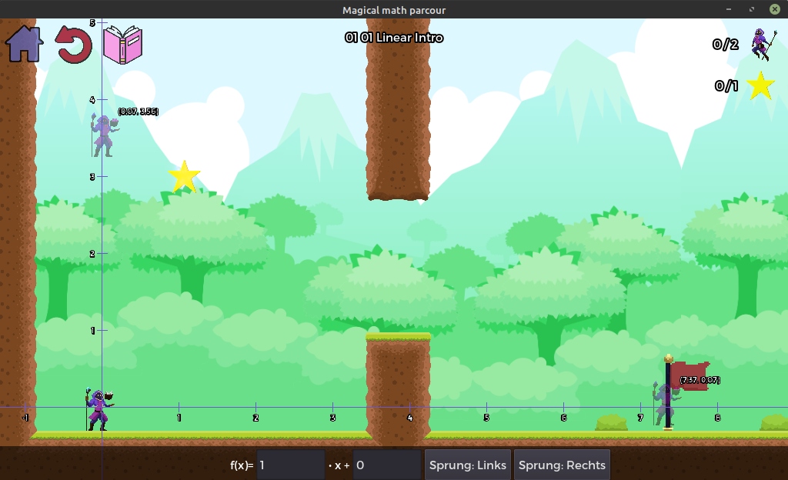
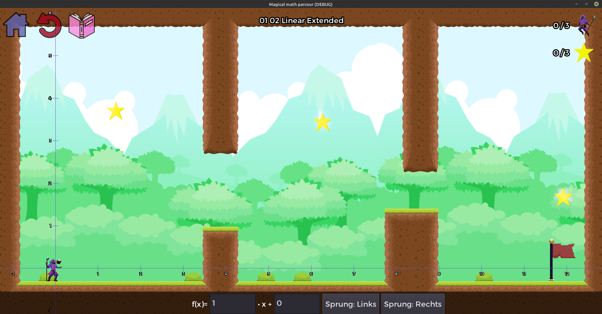
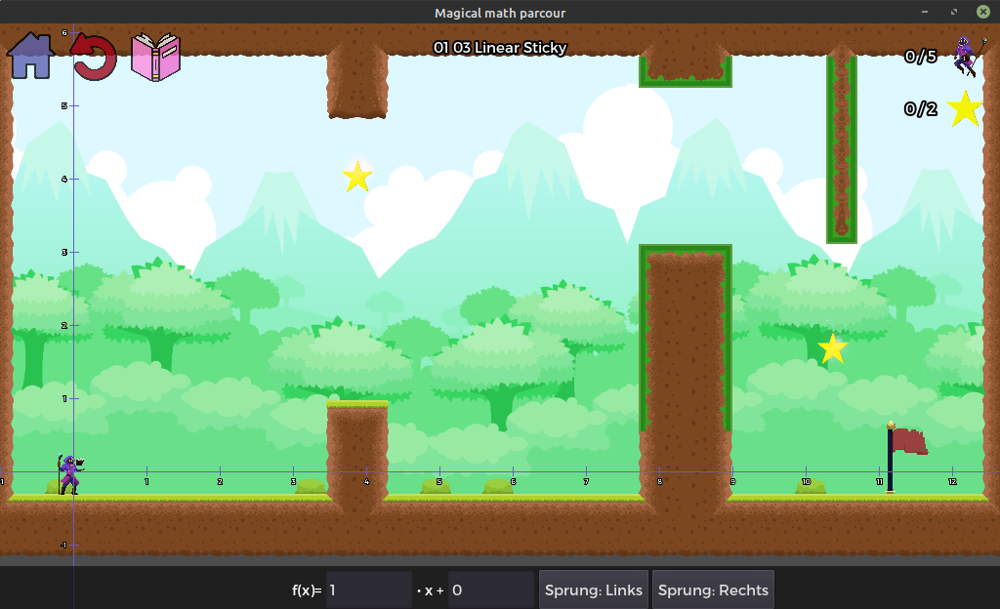
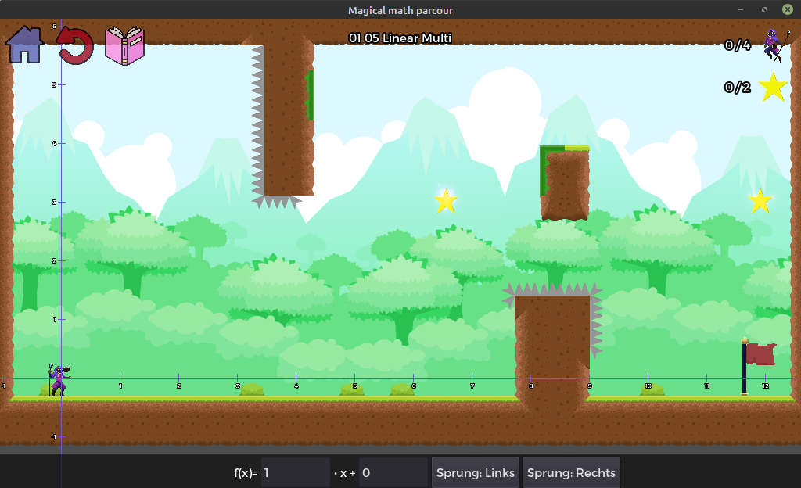
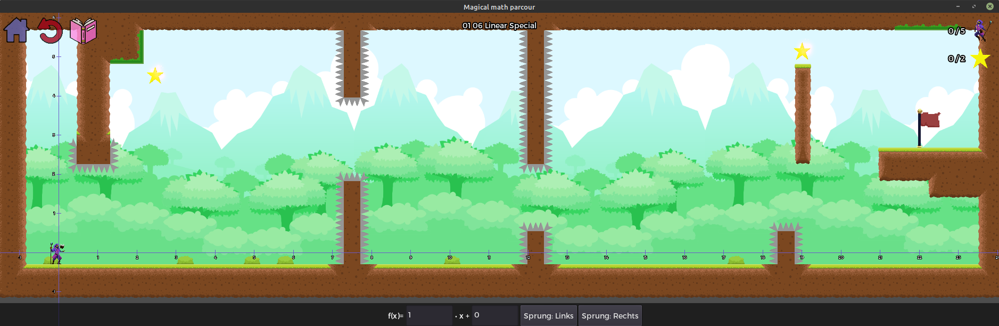

# Magical Math Parkour

Lernspiel zum Üben von Linearen, Quadratischen und Sinus Funktionen.

Entstanden während des Modules "MINT- In Praxis und Lehre" an der Technischen Hochschule Ostwestfahlen-Lippe.

Autoren:
- Etienne Schmidt
- Jan Lüking
- David Schelinski

# Screenshots

## Tutorial

## Lineare Level

### Level 1

### Level 2

### Level 3

### Level 4

### Level 5

### Level 6

